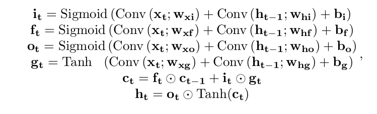

# Bidirectional multi-layer ConvLSTM implementation

[This](https://github.com/daleigehhh/Bidirectional_ConvLSTM/blob/main/ConvLSTM.py) file contains the implementation of Bidirectional Convolutional LSTM in PyTorch, you can find the code base from this [repo](https://github.com/ndrplz/ConvLSTM_pytorch?tab=readme-ov-file)

Note that the dynamics is as follows:

This is implemented as convolve the concatenated hidden state and input image along the channel dimension than split the result.

# Usage

Just like [LSTM](https://pytorch.org/docs/stable/generated/torch.nn.LSTM.html) class in Pytorch except here the embeddings are maps.

- inputs

  input, (h_0, c_0)

  Inputs are `[batch, seq_len, channels, height, width]` 5d tensors(batch not first is also supported). The hidden state and cell state are default to zero tensors which shape is `[batch, height, width]` for every layer. Stateful implementation is leaved not implemented.

- outputs

  output, (h_n, c_n)

  output is a tensor of shape `[batch, seq_len, hidden_channels]` or `[batch, seq_len, hidden_channels*2]`  if **bidirectional** is enabled.

  or if you need the outputs of every layer, you can set the argument **return_all_layers** to True, then the output is of shape `[batch, num_layers, seq_len, channels, height, width]`

